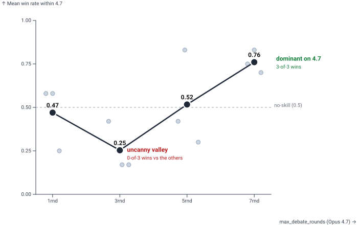

# LLLibrary

> Field notes on LLM evaluation and agent systems — one page per lesson,
> grounded in real experiments and real numbers.

```
   langgraph-agents ──┐
         job-cannon ──┤
      resume-engine ──┼──►  LLLibrary  ──►  evals · patterns · anti-patterns · incidents
   nit-pick-supreme ──┘
```

Each headline below links to the page that earns it.

---

### [A four-metric panel separates rank agreement from score calibration.](wiki/anti-patterns/pearson-r-only-eval.md)

Pearson r is invariant to affine transforms — a model scoring `truth + 25`
returns r=1.0 with perfect rank order and zero bias signal. Adding
**mean_delta** (bias), **MAE** (per-row error), and **bucket_deltas**
(where inflation concentrates — always at the low end) turns a single
correlation into a panel that distinguishes "agrees on order" from
"agrees on values."

### [One cross-family judge is enough to detect same-family inflation.](wiki/evals/judge-family-bias.md)

Two Anthropic judges scoring an Anthropic-vs-Anthropic comparison agreed
on every cell. One cross-family judge (DeepSeek V4 Pro) disagreed on a
third of them — clustered at the low-signal configurations where
divergence is expected and meaningful. Locking the deflation band
**before** the run (not after reviewing results) is a cheap mitigation
that preserves verdict integrity without a full multi-judge panel.

### [Pairwise judges have measurable position bias; double-call with swapped orderings ties it out.](wiki/evals/position-bias-correction.md)

LLM judges in pairwise preference eval pick the same *position* roughly
**one in five** times — 18.7% on the baseline 10-config matrix, ~17%
on a separate cross-family judge sample. Asking the judge to rank
`A vs B` *and* `B vs A`, then scoring same-position-twice as a tie and
same-response-twice as a real win, converts the bias into a measured
noise floor at the cost of doubled judge calls. Averaging across many
pairs without this correction does not wash the bias out — it just
reduces variance around a shifted mean.

### [Stratified sampling across the score range makes provider evals reliable.](wiki/incidents/cerebras-false-positive-adoption.md)

An n=10 screening eval skewed toward high-scoring jobs, where a 25-point
inflation ceiling-clips at 100 and reads as agreement. Re-running at
n=30 with coverage across the full score distribution returned the real
signal: `r=0.808`, **+30.5** mean delta. The methodology overhaul that
followed now catches this pattern systematically, across every provider
class.

### ["3" on a 1-5 rubric conflates "neutral evidence" with "no information."](wiki/anti-patterns/no-signal-vs-midpoint.md)

An ordinal sub-score has no native encoding for "I can't tell from the
data" — both the labeler and the model collapse missing-info into the
midpoint, and MAE reports false agreement when the two abstain on the
same axis. The fix is structural: an explicit abstention code outside
the 1-5 range, or a forced-evidence requirement that makes abstention
impossible. Once gold labels carry the abstention bit, the eval harness
drops those (axis, row) pairs from per-axis comparison — they were
never measurable in the first place.

### [Pipeline configs tuned on one model generation don't port to the next.](wiki/anti-patterns/configs-port-across-generations.md)



*Mean win rate per `max_debate_rounds` setting against the three other
configs on Opus 4.7. Gray dots are individual pairwise win rates; the
dark line is the mean.*

`max_debate_rounds=3` was the strongest configuration on Opus 4.6
(93.5% win rate). On Opus 4.7 it became the **worst non-trivial choice**
— losing to a single-round debate. Enough rounds to dilute initial
positions, not enough to converge: an uncanny valley produced by the
model upgrade alone. The same logic applies to temperature,
system-prompt length, and few-shot count. Treat the model bump as the
experiment, not the assumption.

### [Each provider in a multi-provider cascade needs its own optimal prompt variant.](wiki/prompting/fewshot-variant-by-model.md)


*Slope chart: each line is one prompt variant. Left endpoint is the
variant's Pearson r against an Opus baseline on Cerebras; right
endpoint is the same against Ollama.*

Four prompt variants across two free providers against an Opus
baseline: `fewshot-distribution` won for Cerebras (**r=0.935**, vs
0.851 baseline) and ranked **4th** for Ollama. Chain-of-thought hurt
Cerebras (r=0.699) and was 2nd best for Ollama (r=0.868). Picking the
best variant on the expensive model and rolling it everywhere wastes
the optimization opportunity at every cheaper cascade step.

### [Twelve heterogeneous review engines, one findings schema, no chained agents.](wiki/patterns/federated-review-engines.md)

[nit-pick-supreme](wiki/projects/nit-pick-supreme.md) dispatches code
engines (Haiku), architectural engines (Opus), and a browser explorer
(Sonnet) in parallel, each emitting JSON in a unified envelope.
Synthesis happens in the orchestrator, not by chaining. Cost discipline
is baked into the topology. Fixes execute in parallel git worktrees and
revert in reverse merge order when regressions appear — replacing the
predecessor's `--allow-failing-tests` flag with automatic baseline
comparison.

### [Let the LLM emit ordinal scores; derive the verdict in code.](wiki/patterns/python-derived-classification.md)

When verdicts are emitted by the model, per-provider bias shifts the
apply/reject distribution directly. When verdicts are derived
deterministically in Python from numeric outputs, a measured bias term
can be subtracted before classification — keeping the production decision
distribution stable even as individual providers drift.

### [Write the case study while the surprise is still fresh.](wiki/workflows/failure-mining.md)

The non-obvious lessons live in the aborted runs, the misdiagnoses, and
the prompts that needed five rejection rounds. The load-bearing question
is rarely *what went wrong*; it is *why didn't we notice for twelve
days*. Once the recovery narrative settles, that question gets harder to
answer honestly — and the lesson most worth preserving goes with it.

---

For the full set: [`wiki/anatomy.md`](wiki/anatomy.md) (flat sitemap) ·
[`wiki/index.md`](wiki/index.md) (themed) · the repo opens cleanly as an
[Obsidian](https://obsidian.md) vault.

### Source projects

| Project | Role |
|---|---|
| [langgraph-agents](https://github.com/Senkichi/langgraph-agents) | Debate-style LLM evaluation framework |
| [job-cannon](https://github.com/Senkichi/job-cannon) | Multi-provider job-scoring cascade |
| [resume-engine](wiki/projects/resume-engine.md) | Application tailoring pipeline *(private)* |
| [nit-pick-supreme](wiki/projects/nit-pick-supreme.md) | Federated code review tool *(private)* |

[CC BY 4.0](LICENSE) — reuse with attribution.
