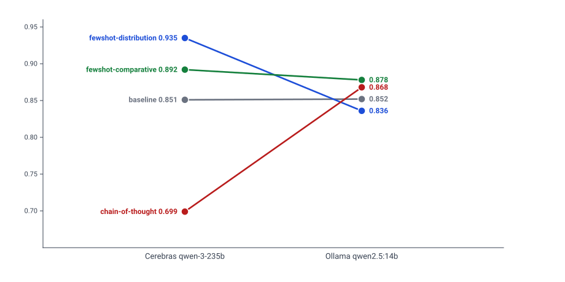

# Prompt-engineering variants are model-specific

Different models respond to different prompting techniques **differently**. There is no single "best prompt variant" across a multi-provider cascade — each provider needs its own optimal variant.

*Slope chart: each line is one prompt variant. Left endpoint is the variant's Pearson r against an Opus baseline on Cerebras; right endpoint is the same against Ollama. The crossing of `chain-of-thought` (Cerebras's worst variant) past `fewshot-distribution` (Cerebras's best) is the rank inversion.*

## The specific data ([job-cannon](https://github.com/Senkichi/job-cannon), 2026-03-29)

Tested 4 prompt variants (baseline, fewshot-distribution, fewshot-comparative, chain-of-thought) against two free providers using the same Opus baseline. Pearson r against Opus:

| Variant | Cerebras qwen-3-235b | Ollama qwen2.5:14b |
|---------|---------------------:|-------------------:|
| baseline | 0.851 | 0.852 |
| fewshot-distribution | **0.935** | 0.836 |
| fewshot-comparative | 0.892 | **0.878** |
| chain-of-thought | 0.699 | 0.868 |

The winner for Cerebras (`fewshot-distribution`) is the **4th best** for Ollama. The winner for Ollama (`fewshot-comparative`) is **3rd** for Cerebras. **Chain-of-thought hurt Cerebras (r=0.699)** but was 2nd best for Ollama (r=0.868).

Model architecture affects how prompting techniques work. Assuming one-size-fits-all wastes the optimization opportunity.

## The implication for a multi-provider cascade

Each step in a multi-provider cascade — where each step routes to a different provider by cost — should use its own optimal prompt variant. This is more configuration to maintain — but the win-rate gain is large (Cerebras going from r=0.851 baseline → 0.935 fewshot-distribution is the difference between MARGINAL and SUITABLE per [[anti-patterns/pearson-r-only-eval]]'s thresholds).

## Screening protocol (cheap)

[job-cannon](https://github.com/Senkichi/job-cannon)'s methodology:

1. Test all variants × all available models in **parallel** (different providers have independent rate limits — use a formula for computing safe `--delay` between requests from provider rate limits)
2. Use small batches (n=10) for screening
3. Promote winners to n=30 for confirmation
4. Each cascade step uses its own promoted variant

The parallelism point is operational: at small N, a single screening pass per (model, variant) is fast if you parallelize across independent free-tier rate buckets. Sequential screening on one provider blocks on its TPM.

## When to RE-screen

When a provider rolls a new model version (provider-side opaque update), the optimal variant can shift. Re-screen any cascade step where the provider's model alias points at a new underlying model — the same class of bug surfaced at Anthropic when the `opus` alias silently flipped from `claude-opus-4-6` to `claude-opus-4-7`, which broke a config that had been tuned to the older model. Lock to explicit model IDs where the provider exposes them.

## Anti-pattern

> "We picked the best variant on Opus and rolled it everywhere."

This produces a cascade where every step uses a variant tuned for a model that isn't deployed there. The visible symptom is degraded correlation against baseline at every cascade step that wasn't the tuning target.

## Generalization

Same lesson applies in pipeline-tuning research: see [[anti-patterns/configs-port-across-generations]] for the model-version axis of the same generalization. Pipeline knobs and prompt variants are both model-specific. Re-tune both when the model changes.

## Related

- the provider correlation leaderboard against the Opus baseline
- [[anti-patterns/pearson-r-only-eval]] — but you still need MAE + bias on top of r
- the multi-provider cascade architecture this matters in
- the rate-limit-delay formula for parallelizing across providers without hitting 429s
